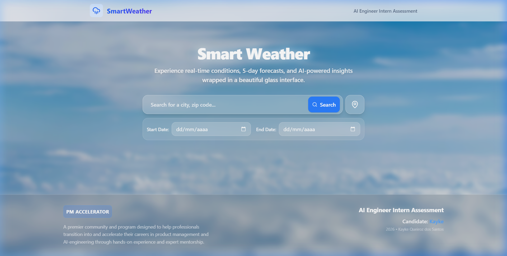
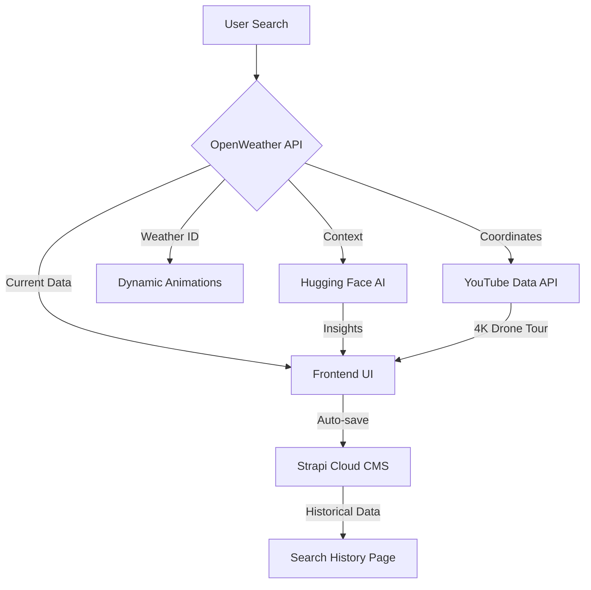

# 🌤️ SmartWeather — Full Stack AI Weather Intelligence

SmartWeather is a premium, full-stack weather intelligence platform that blends high-performance engineering with immersive visuals. It provides real-time weather data, AI-powered health/activity insights, and cinematic 4K drone tours, all wrapped in a stunning glassmorphism interface.

> **🚀 Deployment Status:**
> - **Frontend:** Deployed on [Vercel](https://smart-weather-sigma.vercel.app/)
> - **Backend:** Deployed on [Strapi Cloud](https://sua-url.strapiapp.com)

---

## 📸 Screenshots

<div align="center">
  
  <p><i>The main dashboard featuring real-time weather, search, and date range selection in a sleek glassmorphism UI.</i></p>
</div>

*(Tip: Search for 'London' to see the dynamic rain effects or 'Natal, BR' for clear skies!)*

---

## ⚙️ Tech Stack

| Area | Technologies |
| :--- | :--- |
| **Frontend** | React 19, Vite, TypeScript, Tailwind CSS 4, Framer Motion |
| **Backend** | Strapi 5 (Headless CMS), SQLite |
| **AI Layer** | Hugging Face Inference API (Qwen 2.5-72B), YouTube Data API v3 |
| **Mapping** | React Leaflet (OpenStreetMap) |
| **Infrastructure** | Vercel (Frontend), Strapi Cloud (Backend) |

---

## 🔄 Application Flow

The system orchestrates multiple APIs and a headless CMS to deliver a seamless experience:



1. **Search**: User inputs a city, zip code, or landmark.
2. **Intelligence**: System fetches weather then triggers AI for personalized health/activity insights.
3. **Immersive UI**: The background morphs based on the specific Weather ID, while YouTube fetches a cinematic tour.
4. **Persistence**: Every search is automatically saved to Strapi Cloud for history and analysis.

---

## 📁 Project Structure

```text
SmartWeather/
├── front/                  # React + Vite Frontend
│   ├── src/
│   │   ├── components/     # UI Components (Weather Cards, Map, History)
│   │   │   └── WeatherBackground/ # Canvas-based shader-like effects
│   │   ├── services/       # Modular API layer (Weather, AI, YouTube, Strapi)
│   │   ├── pages/          # Main application views
│   │   └── assets/         # Static resources & styles
│   └── public/             # Static assets
└── back/                   # Strapi 5 Headless CMS
    ├── src/
    │   ├── api/            # Content Types (Weather Records)
    │   └── ...
```

---

## 🌧️ Dynamic Animations

One of the project's key differentiators is its **weather-reactive background system**. Instead of simple static images, we use a combination of **Framer Motion** and **CSS-based particle systems**:

- **Rain/Snow**: Utilizes dynamic React components that generate particles based on weather intensity.
- **Clouds**: Layered SVG/CSS animations that vary speed and opacity based on cloud coverage.
- **Clear/Sunny**: Vibrant gradient shifts and sun-glow effects.
- **Precision logic**: Mapping occurs via `weatherId` (e.g., 200-299 for Thunderstorms) to ensure exact visual parity with real-world conditions.

---

## 🧠 Engineering Highlights

- **Decoupled Full-Stack Architecture**: Clean separation between the React frontend and Strapi backend allows for independent scaling and maintenance.
- **AI-Driven Personalization**: Leveraging **Qwen 2.5-72B** to provide non-generic health warnings and clothing suggestions based on humidity, temperature, and wind.
- **Optimized Data Export**: Custom implementation for history export to **JSON** and **CSV** formats directly from the frontend.
- **CORS & Proxy Resilience**: Engineered robust API service layers to handle cross-origin requests and best-effort backend warmups.

---

## 👨‍💻 Candidate Information
*   **Name:** Kayke Queiroz dos Santos
*   **Assessment:** AI Engineer Intern Technical Assessment
*   **Organization:** [PM Accelerator](https://www.linkedin.com/company/product-management-accelerator/)

---

## 🚀 Local Setup

1. **Install Dependencies**:
   ```bash
   cd front && npm install
   cd ../back && npm install
   ```
2. **Env Variables**: Add your API keys to `front/.env`.
3. **Run**:
   ```bash
   # Front
   npm run dev (in /front)
   # Back
   npm run develop (in /back)
   ```

---

## PM Accelerator Description
*Product Manager Accelerator is a premier community and program designed to help professionals transition into and accelerate their careers in product management and AI-engineering through hands-on experience and expert mentorship.*

---

